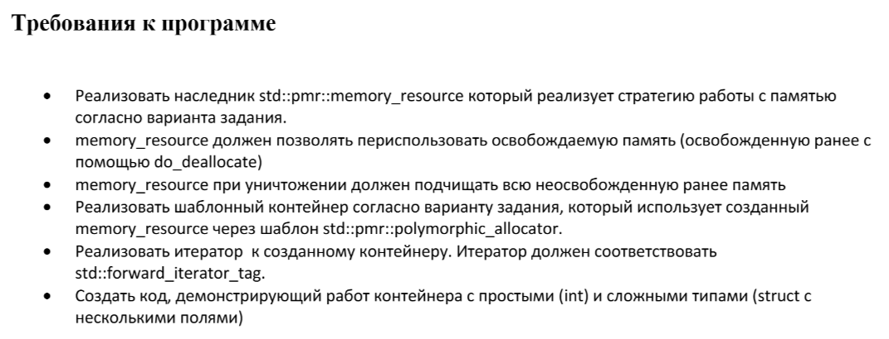

# ООП Лабораторная работа №5

М8О-211БВ-24: Губеев Давид Илембаевич
Вариант 16


### Задание:
### Контейнер: 
Динамический массив
### Стратегия memory resource: 
Динамическое выделение памяти: для каждого объекта выделяется блок памяти на куче, информация о выделенных блоках сохраняется в std::list

## Клонирование репозитория

```bash
git clone https://github.com/Dearale/OOP_Lab_5.git
```
## Запуск программы
```
mkdir build
cd build
cmake ..
make
./main_exe  # запуск программы
./tests      # запуск тестов
```
